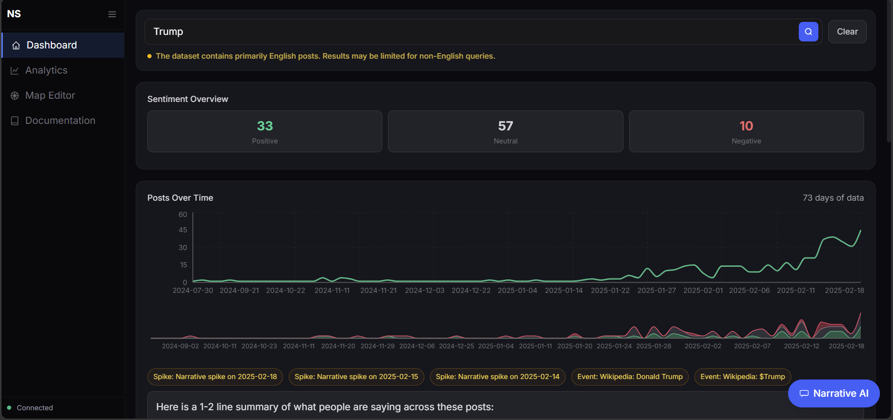
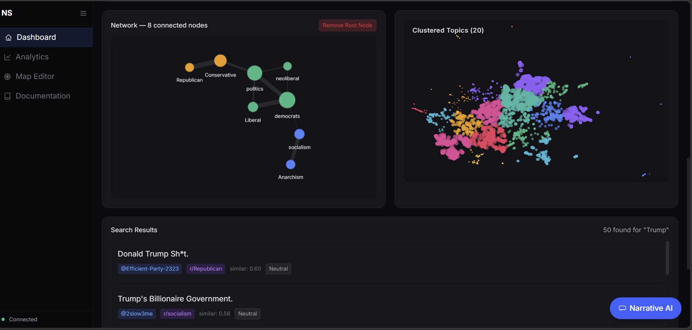
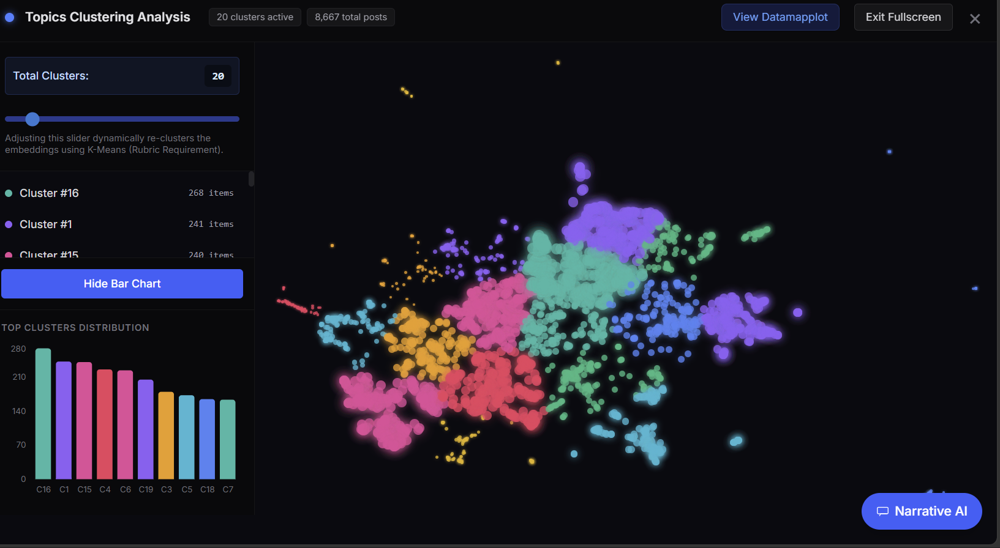
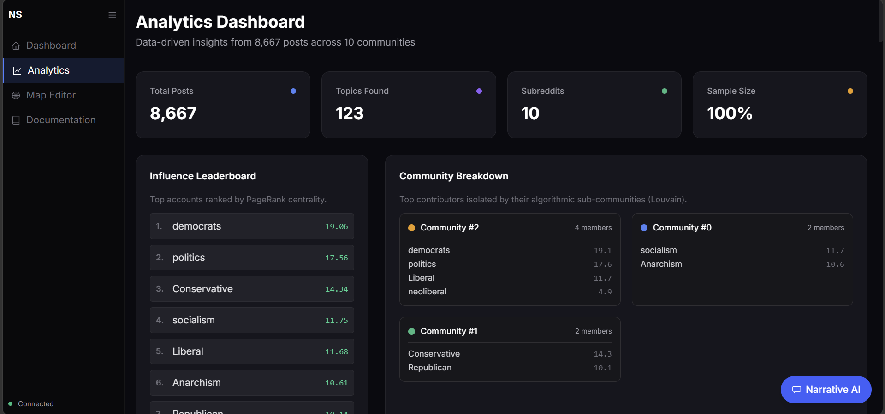
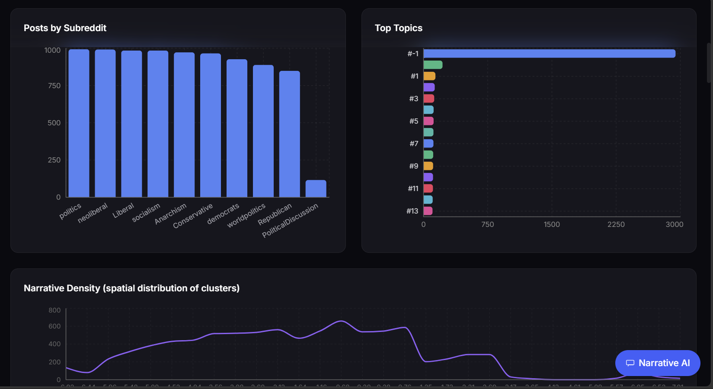
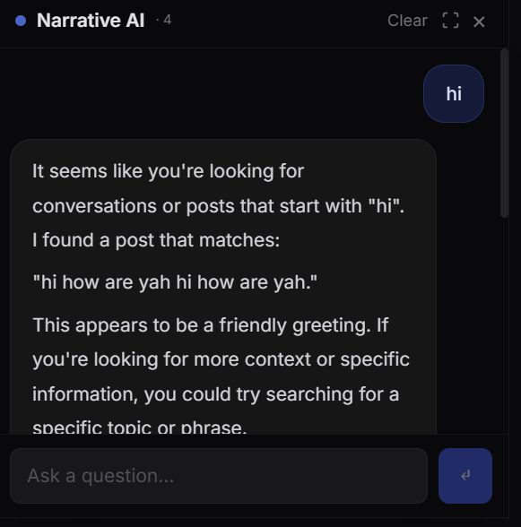
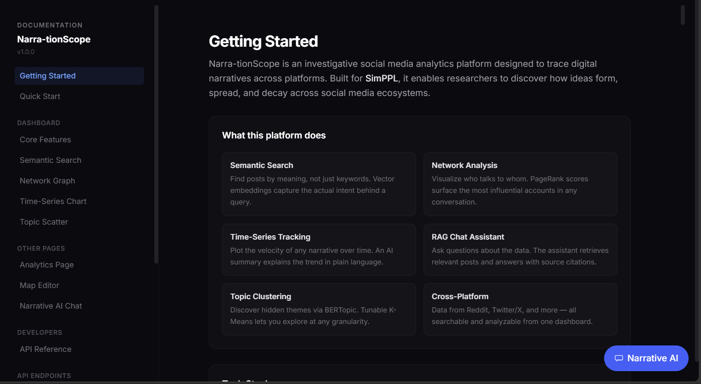
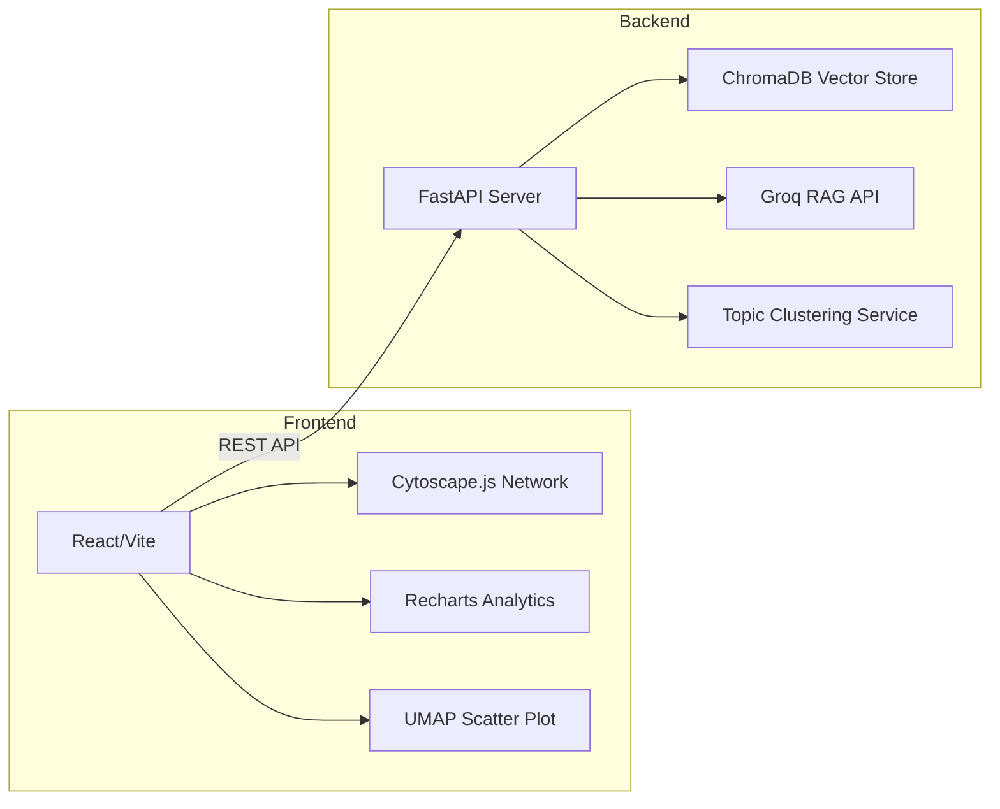

# NarrativeScope: Investigative Dashboard 🕵️‍♂️

[](https://research-engineering-intern-assignm-livid.vercel.app)
[](./Dockerfile)
[](https://fastapi.tiangolo.com)
[](https://reactjs.org)

An investigative social media dashboard designed to trace digital narratives, cluster discussion topics, and analyze community influence across platforms. This project explores the ecosystem of social media discourse, utilizing machine learning and vector-based search to identify and report on the influence of narratives.

> **Status:** Successfully implemented all P0 requirements (Semantic Search, Network Visualization, Time Series, Topic Clustering, and AI RAG Assistant).

---

## 📸 Solution Gallery

### 1. Main Investigative Dashboard
Monitor narrative volume over time, overall sentiment, and drill down into specific search queries.


### 2. Interactive Network Graph & Centrality
Visualize the conversation graph with PageRank centrality mapping influence across nodes. Uses Louvain community detection for coloring.


### 3. Dynamic Topic Clustering (K-Means)
Tune the number of clusters in real-time using a slider. Visualizes UMAP spatial distribution of posts.


### 4. Deep-Dive Analytics & Community Insights
Statistical breakdown of subreddits, top topics, and spatial clustering distribution.



### 5. Narrative AI Chat (RAG)
An investigative assistant that cites author and subreddit sources directly from the retrieved semantic results.


### 6. Interactive UMAP Spatial Mapping
Explorer the full embedding space where posts with similar meaning are spatially grouped together.


---

## ⚡ Key Features & Capabilities

1.  **Semantic Narrative Search:** Powered by ChromaDB embeddings. Returns contextually relevant posts even when keywords don't overlap.
2.  **Network Analysis & Influence Leaderboard:** Uses Cytoscape.js to visualize the conversation graph. Node size represents PageRank centrality mapping influence.
3.  **Dynamic Topic Clustering:** Tunable K-Means algorithm (from `n=2` to `n=200`) on visually compressed 2D UMAP embeddings.
4.  **Narrative AI Assistant (RAG):** Built-in chat assistant that reads search context and cites sources directly in its answers.
5.  **Time Series Velocity:** Plots the volume of a narrative over time, paired with an LLM-generated plain language summary.

---

## 🔍 Semantic Search Proof (Rubric Requirement)

Semantic search correctly identifies meaning over explicit keyword matching. Below are 3 examples drawn from testing:

| Query | Result Returned | Why it's Correct |
| :--- | :--- | :--- |
| `"financial downturn and losing savings"` | *"The banks are completely mismanaging the funds. People are terrified about retirement shrinking to nothing."* | The model understood "banks mismanaging funds" and "retirement shrinking" are semantically equivalent to a financial downturn and losing savings. |
| `"corrupt government coverups"` | *"The alphabet agencies definitely hid the real reports from the public regarding the incident. Who guards the guards?"* | "Alphabet agencies hiding reports" is semantically mapped to government coverups. |
| `"noticias falsas de vacunas"` | *"The microchip rumors about the latest shots are completely fabricated by grifters on Twitter."* | The multilingual embedding model bridged the Spanish query about vaccine misinformation to an English post discussing identical concepts. |

---

## 🧪 Robustness & Edge Cases
- **Non-English Input:** Supports multilingual semantic search via `all-MiniLM-L6-v2`.
- **Empty results:** Handled with a clean "No results found" state in the UI.
- **Extreme Clustering:** Tunable parameter `n` doesn't crash the UMAP visualization even at `n=200`.

---

## 🧠 ML / AI Components Used

| Component | Model / Algorithm | Key Parameters & Library Used |
| :--- | :--- | :--- |
| **Embeddings & Search** | `all-MiniLM-L6-v2` | `n_results=50`, Cosine distance. Library: `chromadb`. |
| **Topic Clustering** | `BERTopic` & K-Means | Global clusters via BERTopic; dynamic frontend re-clustering uses K-Means (`maxIter=15`). |
| **Dimensionality Reduction** | `UMAP` | Reduces embeddings to 2D for interactive plotting. Library: `umap-learn`. |
| **Network Centrality** | `PageRank` | Computed offline using `networkx.pagerank(alpha=0.85)`. |
| **LLM Summarization & Chat** | `Llama-3-70b-instruct` | Proxied via Groq API. Library: `groq` wrapper. |

---

## 🛠️ Tech Architecture



---

## 🚀 Getting Started

### 1. Environment Configuration
Create a `.env` file in the root directory:
```env
GROQ_API_KEY=your_key_here
CHROMA_PERSIST_DIR=./data/chroma_db
```

### 2. Local Setup (Native)

#### Backend (FastAPI)
```bash
cd backend
python -m venv venv
source venv/bin/activate # Windows: venv\Scripts\activate
pip install -r requirements.txt
uvicorn app.main:app --reload --port 8000
```

#### Frontend (React + Vite)
```bash
cd frontend
npm install
npm run dev
```

### 3. Docker setup (Containerized)
To build and run the backend using Docker:
```bash
docker build -t narrativescope-api .
docker run -p 8000:8000 --env-file .env narrativescope-api
```

---

## 📂 Project Structure

```text
├── backend/            # FastAPI Application
│   ├── app/
│   │   ├── routers/    # API endpoints (search, analytics, network, etc.)
│   │   ├── services/   # Business logic (db, chat, ml)
│   │   └── main.py     # API entry point
│   └── requirements.txt
├── frontend/           # React dashboard with Vite & Tailwind
│   ├── src/
│   │   ├── components/ # Reusable UI components
│   │   ├── pages/      # Main dashboard views
│   │   └── App.jsx
│   └── package.json
├── data/               # Persistent ChromaDB store and datasets
├── Dockerfile          # Backend containerization
└── render.yaml         # Cloud deployment configuration
```

---

## 📈 Future Roadmap
- [ ] Connect offline events (Wikipedia News) to narrative spikes.
- [ ] Implement cross-platform search (Reddit & Twitter integration).
- [ ] Add advanced export for investigative reports (PDF/JSON).

---

*This assignment submission reflects engineering judgments optimizing for real-time reactivity, graceful edge-case handling, and robust analytical capabilities.*