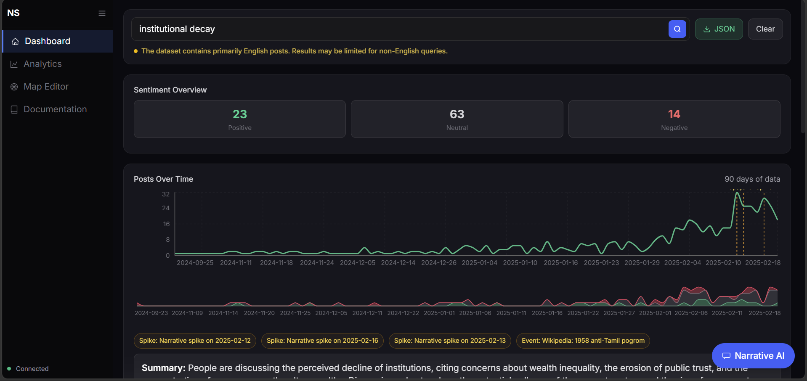
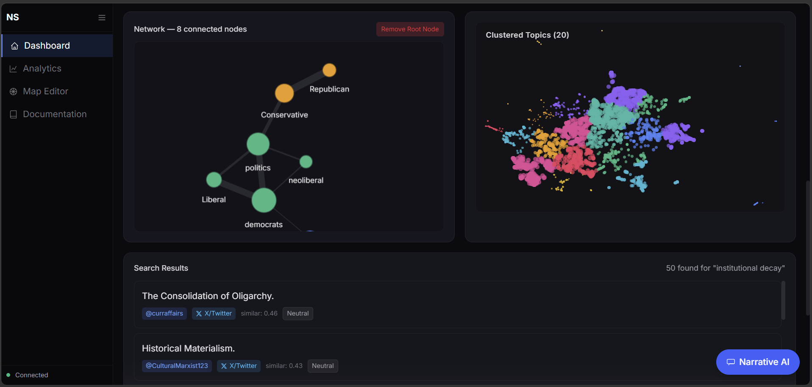
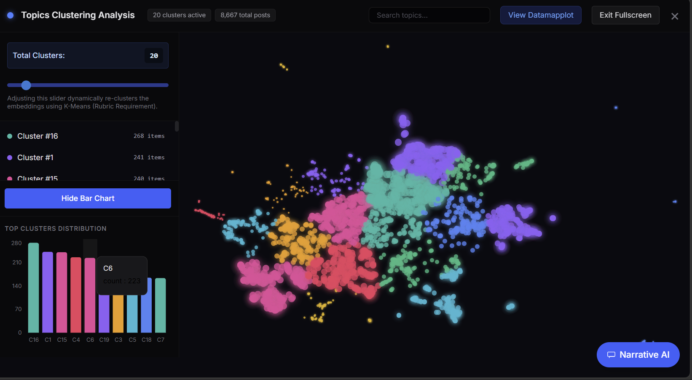
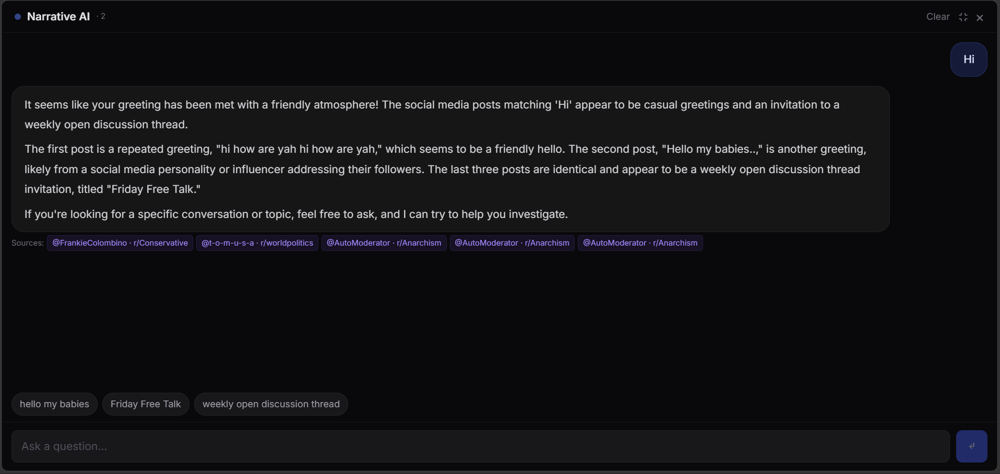

# NarrativeScope Frontend 🎨

This directory contains the React/Vite/Tailwind-based dashboard for the NarrativeScope project. It provides researchers with interactive tools to explore social media narratives through semantic search, network analysis, and spatial clustering.

## 🚀 Key Dashboard Features

### Investigative Search
Semantic search that understands the intent behind your queries, powered by ChromaDB embeddings.


### Network Analysis
Interactive visualization of conversation graphs using `cytoscape.js`.


### Spatial Topic Clustering
Visualizing UMAP-reduced embeddings with real-time K-Means clustering.


### RAG AI Assistant
An AI chat assistant that uses search context to provide sourced answers.


## 🛠️ Tech Stack

- **Framework**: React 18+ (Vite)
- **Styling**: TailwindCSS
- **Visualizations**: 
  - `cytoscape.js` (Network Graphs)
  - `recharts` (Analytics Charts)
  - `UMAP` (Spatial Mapping)
- **State Management**: React Hooks

## 📦 Getting Started

1.  **Install Dependencies**:
    ```bash
    npm install
    ```

2.  **Start Dev Server**:
    ```bash
    npm run dev
    ```

3.  **Environment Variables**:
    Ensure the backend is running at `http://localhost:8000` or update the API endpoint in `.env`.
